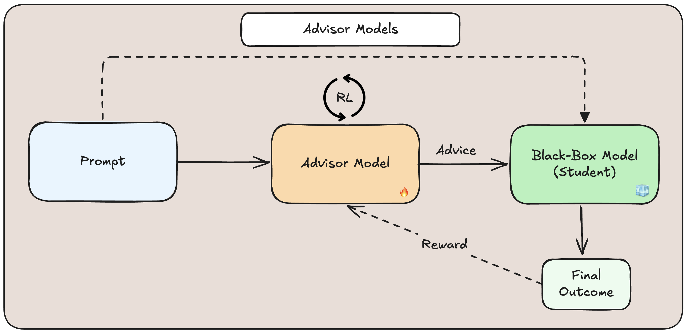
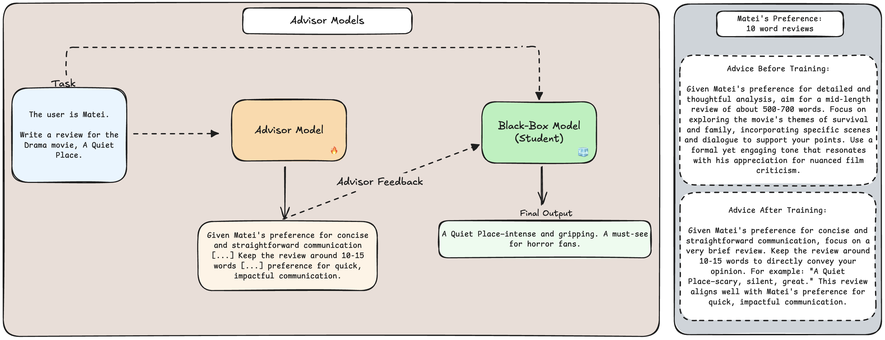

# How to Train Your Advisor: Steering Black-Box LLMs with Advisor Models

Authors: *Parth Asawa\*, Alan Zhu\*, Matei Zaharia, Alexandros G. Dimakis, Joseph E. Gonzalez*

*Equal contribution.

📜 Paper: [https://arxiv.org/pdf/2510.02453](https://arxiv.org/pdf/2510.02453)

## Setup

Run ```uv sync``` to install local development dependencies. Activate your virtual environment with ```source .venv/bin/activate```.

To setup the (separate) training virtual environment for all example environments, run the following commands:

```bash
cd SkyRL/skyrl-train
uv sync --extra vllm
source .venv/bin/activate
uv add litellm==1.74.15.post1
uv add math-verify
uv add evaluate
uv pip install sacrebleu
```

Training script examples are provided in the ```advisor_models``` directory, along with templates for new environments. You will also need to have specified an ```OPENAI_API_KEY``` and ```WANDB_API_KEY``` in your environment.

## Advisor Models



### Overview

Customizing powerful, black-box models is a major challenge, with most practitioners typically limited to static prompting.

We propose a framework to train a small open-source “advisor” model to guide black-box models via feedback, optimizing the model to your specific environment, task, or users with RL.

We show that Advisor Models are highly effective for personalizing and adapting black-box models to specific environments. We additionally test the system in reasoning-intensive tasks, finding properties of the framework under which Advisor Models work best, and demonstrating the system robustness across models and environments.

### Example


## 📜 License

**Advisor Models** is Apache 2.0 licensed, making it suitable for both academic and commercial use.

## 📧 Contact

Please feel free to reach out at pgasawa@berkeley.edu & aczhu@berkeley.edu!

## 📋 Citation

```text
@article{asawa2025trainadvisorsteeringblackbox,
  title={How to Train Your Advisor: Steering Black-Box LLMs with Advisor Models},
  author={Parth Asawa and Alan Zhu and Matei Zaharia and Alexandros G. Dimakis and Joseph E. Gonzalez},
  year={2025},
  journal={arXiv preprint arXiv:2510.02453},
} 
```